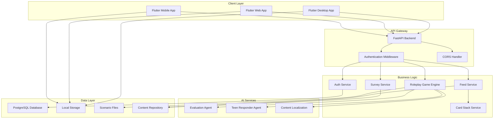

# Design Document

## Overview

The EduParent app is a cross-platform parenting education platform built with Flutter frontend and FastAPI backend. The system provides three core features: a knowledge feed system for daily learning, interactive roleplay scenarios for conversation practice, and daily action challenges for personalized guidance. The architecture emphasizes user data isolation, multi-language support, and evidence-based content delivery.

## Architecture

### High-Level System Architecture



### Technology Stack

**Frontend (Flutter)**
- Framework: Flutter 3.9+ with Material Design 3
- State Management: Provider pattern with ChangeNotifier
- Local Storage: SharedPreferences (progress), flutter_secure_storage (auth tokens)
- HTTP Client: Built-in http package
- Internationalization: easy_localization package
- Platforms: iOS, Android, Web, macOS

**Backend (FastAPI)**
- Framework: FastAPI with Python 3.12+
- Package Management: uv for dependency management
- Database ORM: SQLAlchemy with Alembic migrations
- Authentication: JWT tokens with bcrypt password hashing
- AI Integration: OpenAI API for evaluation and response generation
- Content Management: YAML-based scenario files

**Infrastructure**
- Database: PostgreSQL 15 (production), SQLite (development)
- Containerization: Docker & Docker Compose
- API Documentation: Auto-generated OpenAPI/Swagger

## Components and Interfaces

### 1. Knowledge Feed System

#### Frontend Components
```dart
class FeedView extends StatefulWidget {
  // Displays daily feed items and card stacks
  // Manages completion state and streak tracking
  // Handles navigation to card stack details
}

class CardStackView extends StatefulWidget {
  // Interactive card stack reader
  // Progress tracking through cards
  // Action quest integration
}

class EnhancedFeedItem {
  // Data model for feed items
  // Supports both simple tips and card stack previews
}
```

#### Backend Services
```python
class FeedService:
  async def get_enhanced_daily_feed(language: str) -> EnhancedFeedResponse
  async def get_daily_feed() -> FeedResponse  # Legacy endpoint

class CardStackService:
  async def get_card_stack(stack_id: str, language: str) -> CardStack
  async def get_card_stack_preview(stack_id: str, language: str) -> CardStackPreview
  async def get_all_card_stack_previews(language: str) -> List[CardStackPreview]
```

#### Data Models
```python
class CardStack(BaseModel):
    id: str
    title: str
    description: str
    cards: List[Card]
    summary: str
    action_quest: Optional[ActionQuest]
    estimated_read_time: int
    total_cards: int

class Card(BaseModel):
    id: str
    title: str
    content: str
    order: int

class ActionQuest(BaseModel):
    id: str
    title: str
    prompt: str
    input_placeholder: str
```

### 2. Interactive Roleplay System

#### Frontend Components
```dart
class RolePlayView extends StatefulWidget {
  // Scenario selection and game management
  // Real-time conversation interface
  // Progress and scoring display
}

class GameState {
  // Comprehensive game state management
  // Multi-round scenario support
  // Evaluation result tracking
}

class ScenarioInfo {
  // Scenario metadata and configuration
  // Multi-language support
}
```

#### Backend Services
```python
class RoleplayGameEngine:
  def create_game_state(scenario_name: str, language: str) -> GameState
  async def process_parent_response(game_state: GameState, response: str) -> GameState
  def get_available_scenarios() -> List[str]
  def get_scenario(scenario_name: str) -> Scenario

class EvaluationAgent:
  async def evaluate(response: str, context: str, language: str) -> EvaluationResult
  async def evaluate_multi_round(response: str, criteria: dict, language: str) -> MultiRoundEvaluationResult

class TeenResponderAgent:
  async def respond(score: int, context: str, language: str) -> TeenResponse
```

#### Data Models
```python
class GameState:
    scenario_title: str
    scenario_background: str
    teen_opening: str
    parent_response: str
    attempts: int
    max_attempts: int
    evaluation: Optional[EvaluationResult]
    teen_response: Optional[str]
    game_completed: bool
    final_score: Optional[int]
    # Multi-round support
    is_multi_round: bool
    current_round: int
    max_rounds: int
    round_attempts: int
    max_round_attempts: int
    multi_round_evaluation: Optional[MultiRoundEvaluationResult]
    round_history: List[RoundResult]
    scenario_completion: Optional[ScenarioCompletion]

class EvaluationResult:
    tone_score: int
    approach_score: int
    respect_score: int
    total_score: int
    feedback: str
    passed: bool

class MultiRoundEvaluationResult:
    criteria_scores: Dict[str, int]
    total_score: int
    max_possible_score: int
    feedback: str
    detailed_feedback: Dict[str, str]
    passed: bool
    round_number: int
```

### 3. Daily Action Challenge System

#### Frontend Components
```dart
class DailyActionChallengeView extends StatefulWidget {
  // Survey interface for goal selection
  // Personalized recommendation display
  // Action tracking and progress
}

class ReportData {
  // Survey response data model
}
```

#### Backend Services
```python
class SurveyService:
  async def generate_report(request: SurveyRequest) -> SurveyResponse
  def get_available_goals() -> List[str]
```

#### Data Models
```python
class SurveyRequest(BaseModel):
    goal: str
    note: Optional[str] = ""

class SurveyResponse(BaseModel):
    goal: str
    note: str
    recommendation: str
    tiny_actions: List[str]
```

### 4. Authentication and User Management

#### Frontend Components
```dart
class AuthService extends ChangeNotifier {
  // JWT token management
  // User session handling
  // Secure storage integration
}

class LoginScreen extends StatefulWidget {
  // User authentication interface
}

class RegisterScreen extends StatefulWidget {
  // Account creation interface
}
```

#### Backend Services
```python
class AuthService:
  async def register_user(user_data: UserRegistration) -> UserResponse
  async def authenticate_user(credentials: UserLogin) -> TokenResponse
  async def get_current_user(token: str) -> User
  def create_access_token(user_id: int) -> str
  def verify_token(token: str) -> Optional[int]
```

#### Data Models
```python
class User(Base):
    id: int
    email: str
    hashed_password: str
    full_name: Optional[str]
    is_active: bool
    created_at: datetime
    updated_at: datetime

class UserRegistration(BaseModel):
    email: str
    password: str
    full_name: Optional[str]

class UserLogin(BaseModel):
    email: str
    password: str

class TokenResponse(BaseModel):
    access_token: str
    token_type: str
    user: UserResponse
```

## Data Models

### Database Schema

```sql
-- Users table
CREATE TABLE users (
    id SERIAL PRIMARY KEY,
    email VARCHAR(255) UNIQUE NOT NULL,
    hashed_password VARCHAR(255) NOT NULL,
    full_name VARCHAR(255),
    is_active BOOLEAN DEFAULT TRUE,
    created_at TIMESTAMP DEFAULT NOW(),
    updated_at TIMESTAMP DEFAULT NOW()
);

-- User progress tracking (future implementation)
CREATE TABLE user_progress (
    id SERIAL PRIMARY KEY,
    user_id INTEGER REFERENCES users(id),
    feed_item_id INTEGER,
    item_type VARCHAR(50), -- 'simple' or 'card_stack'
    completed_at TIMESTAMP DEFAULT NOW(),
    date DATE DEFAULT CURRENT_DATE,
    UNIQUE(user_id, feed_item_id, date)
);

-- Streak tracking (future implementation)
CREATE TABLE user_streaks (
    id SERIAL PRIMARY KEY,
    user_id INTEGER REFERENCES users(id) UNIQUE,
    current_streak INTEGER DEFAULT 0,
    longest_streak INTEGER DEFAULT 0,
    last_activity_date DATE,
    updated_at TIMESTAMP DEFAULT NOW()
);

-- Roleplay session tracking (future implementation)
CREATE TABLE roleplay_sessions (
    id SERIAL PRIMARY KEY,
    user_id INTEGER REFERENCES users(id),
    scenario_name VARCHAR(255),
    session_data JSONB,
    final_score INTEGER,
    completed_at TIMESTAMP,
    created_at TIMESTAMP DEFAULT NOW()
);

-- Action quest responses (future implementation)
CREATE TABLE action_quest_responses (
    id SERIAL PRIMARY KEY,
    user_id INTEGER REFERENCES users(id),
    quest_id VARCHAR(255),
    response_text TEXT,
    created_at TIMESTAMP DEFAULT NOW()
);
```

### Local Storage Schema

```dart
// User-specific progress keys
'feed_read_${userId}_${date}'         // Set<int> of completed item indices
'feed_streak_${userId}'               // int streak count
'feed_read_${userId}_${date}_counted' // bool whether streak counted today
'card_stack_progress_${userId}_${stackId}' // CardStack completion state
'action_quest_responses_${userId}'    // List of ActionQuestResponse
```

## Error Handling

### Frontend Error Handling

```dart
class ApiException implements Exception {
  final String message;
  final int? statusCode;
  
  ApiException(this.message, [this.statusCode]);
}

class ErrorHandler {
  static void handleApiError(dynamic error) {
    if (error is ApiException) {
      // Show user-friendly error message
      _showErrorDialog(error.message);
    } else {
      // Log unexpected errors and show generic message
      _logError(error);
      _showErrorDialog('An unexpected error occurred');
    }
  }
}
```

### Backend Error Handling

```python
from fastapi import HTTPException
from fastapi.responses import JSONResponse

class CustomException(Exception):
    def __init__(self, message: str, status_code: int = 500):
        self.message = message
        self.status_code = status_code

@app.exception_handler(CustomException)
async def custom_exception_handler(request: Request, exc: CustomException):
    return JSONResponse(
        status_code=exc.status_code,
        content={"detail": exc.message}
    )

# Specific error types
class ScenarioNotFoundError(CustomException):
    def __init__(self, scenario_name: str):
        super().__init__(f"Scenario '{scenario_name}' not found", 404)

class GameSessionNotFoundError(CustomException):
    def __init__(self, session_id: str):
        super().__init__(f"Game session '{session_id}' not found", 404)

class AuthenticationError(CustomException):
    def __init__(self, message: str = "Authentication failed"):
        super().__init__(message, 401)
```

### Error Recovery Strategies

1. **Network Errors**: Retry with exponential backoff
2. **Authentication Errors**: Redirect to login screen
3. **Validation Errors**: Show field-specific error messages
4. **Server Errors**: Log error and show generic message
5. **Offline Mode**: Use cached data when available

## Testing Strategy

### Frontend Testing

```dart
// Widget tests for UI components
testWidgets('FeedView displays daily items', (WidgetTester tester) async {
  await tester.pumpWidget(MaterialApp(home: FeedView()));
  expect(find.text('Daily Feed'), findsOneWidget);
});

// Integration tests for user flows
testWidgets('Complete roleplay scenario flow', (WidgetTester tester) async {
  // Test full scenario completion
});

// Unit tests for business logic
test('GameState correctly tracks multi-round progress', () {
  final gameState = GameState(/* ... */);
  gameState.advanceToNextRound();
  expect(gameState.currentRound, equals(2));
});
```

### Backend Testing

```python
# Unit tests for services
@pytest.mark.asyncio
async def test_feed_service_returns_daily_items():
    response = await get_enhanced_daily_feed("en")
    assert len(response.items) > 0
    assert response.streak >= 0

# Integration tests for API endpoints
def test_roleplay_start_game(client: TestClient):
    response = client.post("/api/roleplay/game/start")
    assert response.status_code == 200
    assert "session_id" in response.json()

# Authentication tests
def test_protected_endpoint_requires_auth(client: TestClient):
    response = client.get("/api/users/profile")
    assert response.status_code == 401
```

### End-to-End Testing

```python
# Playwright tests for critical user journeys
async def test_complete_user_journey(page: Page):
    # Register new user
    await page.goto("/register")
    await page.fill("#email", "test@example.com")
    await page.fill("#password", "password123")
    await page.click("#register-button")
    
    # Complete daily feed items
    await page.click("#feed-tab")
    await page.click(".feed-item:first-child .mark-done")
    
    # Start roleplay scenario
    await page.click("#roleplay-tab")
    await page.click(".scenario-card:first-child")
    await page.fill("#parent-response", "I understand you're upset")
    await page.click("#submit-response")
    
    # Verify progress tracking
    expect(await page.locator("#streak-counter").text_content()).to_contain("1")
```

## Security Considerations

### Authentication Security
- JWT tokens with 30-minute expiration
- Secure password hashing with bcrypt
- Token storage in flutter_secure_storage
- Automatic token refresh handling

### Data Protection
- User data isolation with user-specific storage keys
- Input validation and sanitization
- SQL injection prevention with parameterized queries
- XSS protection with proper output encoding

### API Security
- CORS configuration for allowed origins
- Rate limiting on authentication endpoints
- Request size limits
- Secure headers (HSTS, CSP, etc.)

### Privacy Protection
- Minimal data collection
- User data cleanup on logout
- No tracking without consent
- Transparent data usage policies

## Performance Considerations

### Frontend Optimization
- Lazy loading of card stacks and scenarios
- Image optimization and caching
- Efficient state management with Provider
- Responsive UI with adaptive layouts

### Backend Optimization
- Database query optimization with proper indexing
- Async/await patterns for non-blocking operations
- Response caching for static content
- Connection pooling for database access

### Scalability Planning
- Stateless API design for horizontal scaling
- Database sharding strategies for user data
- CDN integration for static assets
- Load balancing for high availability

## Internationalization and Localization

### Supported Languages
- English (en)
- Traditional Chinese (zh-HK)

### Content Localization Strategy
- Scenario files with language-specific content
- Dynamic content translation via AI services
- Cultural adaptation of parenting advice
- Region-specific examples and references

### Implementation Approach
```dart
// Frontend localization
Text('feed.daily_tips'.tr())

// Backend content selection
async def get_localized_content(content_id: str, language: str) -> str:
    if language == "zh-HK":
        return await get_chinese_content(content_id)
    return await get_english_content(content_id)
```

## Deployment Architecture

### Development Environment
- Local Flutter development with hot reload
- Docker Compose for backend services
- PostgreSQL database in container
- API documentation at `/docs`

### Production Environment (Future)
- Flutter Web build deployed to CDN
- FastAPI backend on cloud platform (Railway, Render, or GCP)
- Managed PostgreSQL database
- SSL/TLS encryption
- Monitoring and logging integration
- Automated CI/CD pipeline

This design provides a comprehensive foundation for implementing the three core features while maintaining scalability, security, and user experience quality.